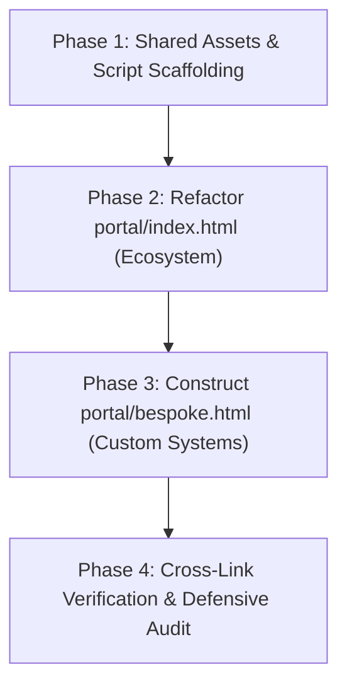

# Frontend Integration Plan: Portal & Bespoke Systems Architecture

**Document Version:** 1.0.0  
**Status:** Pending Approval  
**Author:** Lead Systems Architect (`@architect`)  
**Scope:** Architectural synthesis and UI reconciliation of `portal/index.html`, `portal/index_stitch.html`, and `portal/systems_stitch.html`.

---

## Executive Summary & Design Directive

The Simple Solutions portal web presentation currently exists across three distinct files:
1. `portal/index.html`: The working base featuring established interactive tabs, modals (Video, Login, Checkout), video carousels, and foundational brand styling (Playfair Display + Inter, warm slate canvas).
2. `portal/index_stitch.html`: The Stitch prototype for the ecosystem, containing high-density industrial telemetry, rich micro-UI cards (Nomsa Dlamini QR badge, Act 36 chemical spray check, Bowser fuel ledger, RS232 scale differential), but weighted down by dark cyberpunk terminal aesthetic and outdated pricing tiers.
3. `portal/systems_stitch.html`: The Stitch prototype for custom systems, specifying the fixed-scope commercial model (R14.5k, R38k, R85k+), client proof/testimonials, and consultancy architecture.

This integration plan details the transformation of these assets into two polished, zero-build, CDN-powered production pages:
* **Output A:** [`portal/index.html`](file:///home/luca/dev/simple-solutions-ecosystem/portal/index.html) — **The Operational Ecosystem** (Platform overview, 4 modular spoke apps, interactive tool previews, 4-tier flat site pricing).
* **Output B:** [`portal/bespoke.html`](file:///home/luca/dev/simple-solutions-ecosystem/portal/bespoke.html) — **Bespoke Systems & Data Architectures** (Custom workflow engineering, ClickUp & Power BI architectures, hardware bridging, 3 fixed-scope milestones, verified client proof).

---

## 1. Target File Distribution & Information Architecture

```
portal/
├── index.html                   # OUTPUT A: The Operational Ecosystem
├── bespoke.html                 # OUTPUT B: Bespoke Systems & Data Architectures
├── assets/
│   ├── logos/Simple_Logo...     # Unified brand assets
│   ├── js/                      # Shared vanilla client logic (tabs, modals, carousels)
│   └── images/                  # Media & illustrations
└── admin/ & dashboard/          # Existing authenticated sub-planes
```

### Output A: `portal/index.html` (The Operational Ecosystem)
* **Target Audience:** Farm general managers, packhouse heads, fleet directors, safety compliance officers, and agricultural export processors.
* **Core Value Proposition:** Fast, frontline-first mobile execution tools that replace bloated ERP systems with zero seat taxes and offline resilience.
* **Page Hierarchy:**
  1. **Unified Global Navigation Bar** (with active indicator on "The Ecosystem").
  2. **Hero Section:**
     - Operational badge ("Offline-First Operational Infrastructure • Mission-Critical Field Software").
     - High-impact headline & subheadline.
     - Dual Primary CTAs: "Explore The Ecosystem" (smooth scroll) & "Watch 2-Min Demo" (Vimeo modal trigger).
     - **4 Benefit Metric Bar** (replacing dark telemetry terminal):
       - `100% Offline-First` (Works with zero signal in remote orchards and packhouses).
       - `Zero Seat Tax` (Unlimited frontline workers, drivers, and operators).
       - `< 30s Field Forms` (Thumb-friendly mobile task capture).
       - `1-Click Audits` (GLOBALG.A.P. IFA v6, SIZA, and Act 36 ready export packs).
  3. **The 4-Spoke Modular Ecosystem Section (`#ecosystem`):**
     - Interactive Tab Switcher (`The Vault`, `Spray Trace`, `Fleet & Fuel`, `Packhouse Pass`).
     - Spoke Deep-Dive Showcase combining technical narrative, video catalog carousel (for The Vault), and the high-density micro-UI cards from `index_stitch.html`.
  4. **The Complete Ecosystem Site Bundle (`#bundle`):**
     - Highlighting the consolidated **R2,250 / site / month** enterprise tier.
     - Corporate agribusiness and exporter network callouts.
  5. **Modular & Ecosystem Pricing Architecture (`#pricing`):**
     - Structured 4-tier model (Vault Streaming R180, Vault Essential R280, Full Ecosystem Bundle R2,250, Processor Subsidized Networks).
     - Statutory assurance notice.
  6. **Operational FAQ Section:**
     - Straight answers addressing site vs. seat licensing, worker badge access without email, and offline sync mechanics.
  7. **Unified Global Footer.**

---

### Output B: `portal/bespoke.html` (Bespoke Systems & Data Architectures)
* **Target Audience:** Operational executives and enterprise directors experiencing unique operational bottlenecks requiring custom digital infrastructure.
* **Core Value Proposition:** Fixed-scope, milestone-based custom systems engineering with 100% intellectual property transfer and zero hourly retainers.
* **Page Hierarchy:**
  1. **Unified Global Navigation Bar** (with active indicator on "Bespoke Engineering").
  2. **Contextual Breadcrumb Sub-bar:** Direct navigation indicator (`Core Infrastructure / Bespoke Workflow Systems • 100% Direct IP Transfer`).
  3. **Hero Section:**
     - High-trust industrial headline: "Bespoke Operational Architectures & Data Pipelines".
     - Subtitle emphasizing spreadsheet elimination and operational clarity.
     - Dual CTAs: "Schedule 30-Min Scoping Call" (external Google Calendar) & "View Implementation Roadmap".
     - Trust & Proof Metric Bar (100% Client IP Ownership, Zero Hourly Rates, Direct Senior Engineering).
  4. **Core Philosophy Section:**
     - "Keeping It Simple — Nail the Fundamentals First" (Audit & Distill $\rightarrow$ Standardize & Automate).
  5. **Three Core Capability Pillars:**
     - `01 / Workspace Architecture` (ClickUp hierarchies, permit-to-work pipelines, live KPI boards).
     - `02 / Custom Web Software & Portals` (Tailored mobile field forms, offline IndexedDB PWA engines, client portals).
     - `03 / AI & Automations` (Lab report data extraction, invoice processing, Make.com pipelines, automated ETL).
  6. **Fixed-Scope Commercial Framework (`#roadmap` / `#pricing-models`):**
     - 3-tier milestone model:
       - **Tier 01 // Discovery & Architecture Blueprint (R14,500 fixed project)**.
       - **Tier 02 // Targeted System Sprint (R38,000 fixed milestone — Most Popular)**.
       - **Tier 03 // Full Enterprise Infrastructure (From R85,000 turnkey)**.
     - Direct client software licensing guarantee (no middleman software markups).
  7. **Verified Client Feedback & Social Proof:**
     - 3 featured testimonials: Stephan de Swardt (Verve Water), Kunaal Dukhi (Tigre Solutions), and Quentin Elliott (GG & QG Elliott Farm CC).
  8. **Technical Consultancy FAQ:**
     - Handling non-ClickUp stacks, third-party software licenses, milestone sign-offs, and IP ownership.
  9. **Scoping Call Action Banner & Global Footer.**

---

## 2. Aesthetic & Tone Calibration

### The Challenge
The Stitch prototypes (`index_stitch.html` and `systems_stitch.html`) introduced high-utility components but leaned heavily into a dark, raw cyberpunk terminal design (e.g., `#000000` text-heavy telemetry console, harsh monospaced status labels, high-contrast black callouts). Conversely, `portal/index.html` has a calmer, high-trust executive presentation (Inter typography, slate-50/100 canvas, refined borders, Playfair Display serif accents).

### Calibration Directives
1. **Typography & Styling:**
   - **Primary Body & Interface:** `Inter` (`font-sans`), 400/500/600 weights.
   - **Headings & Display:** Retain `Playfair Display` (`font-serif`) for major section titles to deliver an established, high-trust enterprise finish, paired with clean `Inter` for functional subheadings.
   - **Technical Telemetry & Code Labels:** Use `JetBrains Mono` or Tailwind's `font-mono` sparingly for actual technical badges, serial readings, and timestamps (e.g., `text-xs font-mono uppercase tracking-wider`).
2. **Palette & Canvas:**
   - **Canvas Background:** Soft, clean canvas: `bg-slate-50` with subtle neutral gradients (`from-slate-50 via-slate-100/50 to-slate-50`).
   - **Card Surfaces:** High-trust crisp white (`bg-white`) with gentle hairline borders (`border-slate-200/90`) and subtle shadows (`shadow-sm`, hover: `shadow-md`).
   - **Accents:** Restrain neon greens; adopt high-trust operational emerald (`text-emerald-700`, `bg-emerald-50`, `border-emerald-200`) and deep navy primary (`#0f172a` / slate-900).
3. **Replacing the Dark Hero Telemetry Console:**
   - The dark hero telemetry terminal block from `index_stitch.html` (`core.simpleza.sys // telemetry.v2.8.edge`) is completely retired from the hero.
   - It is replaced with the **Precision Trust Metric Bar** (from `portal/index.html` and `docs/index_layout.pdf`), featuring 4 clean, light-surface benefit tiles:
     ```html
     <!-- 4-Benefit Precision Metric Bar -->
     <div class="mt-16 mx-auto max-w-5xl rounded-2xl border border-slate-200/80 bg-white/95 backdrop-blur-sm shadow-sm overflow-hidden">
       <div class="grid grid-cols-1 sm:grid-cols-2 lg:grid-cols-4 divide-y sm:divide-y-0 sm:divide-x divide-slate-200/80">
         <div class="p-6 text-center">
           <div class="inline-flex items-center justify-center w-8 h-8 rounded-full bg-emerald-50 text-emerald-600 mb-2">⚡</div>
           <p class="text-lg font-bold text-slate-900">100% Offline-First</p>
           <p class="mt-1 text-xs text-slate-500">Works with zero signal in remote orchards and packhouses.</p>
         </div>
         <div class="p-6 text-center">
           <div class="inline-flex items-center justify-center w-8 h-8 rounded-full bg-emerald-50 text-emerald-600 mb-2">👥</div>
           <p class="text-lg font-bold text-slate-900">Zero Seat Tax</p>
           <p class="mt-1 text-xs text-slate-500">Unlimited frontline workers, drivers &amp; operators.</p>
         </div>
         <div class="p-6 text-center">
           <div class="inline-flex items-center justify-center w-8 h-8 rounded-full bg-emerald-50 text-emerald-600 mb-2">⏱️</div>
           <p class="text-lg font-bold text-slate-900">&lt; 30s Field Forms</p>
           <p class="mt-1 text-xs text-slate-500">Thumb-friendly mobile task capture for operators.</p>
         </div>
         <div class="p-6 text-center">
           <div class="inline-flex items-center justify-center w-8 h-8 rounded-full bg-emerald-50 text-emerald-600 mb-2">📋</div>
           <p class="text-lg font-bold text-slate-900">1-Click Audits</p>
           <p class="mt-1 text-xs text-slate-500">GLOBALG.A.P., SIZA &amp; OHSA ready export packs.</p>
         </div>
       </div>
     </div>
     ```

---

## 3. Component Synthesis & UI Architecture

### 3.1 Synthesis of the 4 Ecosystem Spoke Cards & Tabs
The tab switcher from `portal/index.html` provides seamless navigation without cognitive overload. Within each active tab, we fuse the descriptive copy, feature checklists, and video carousels with the **real-world technical micro-UI cards** from `index_stitch.html`:

```
+-------------------------------------------------------------------------------+
| TAB NAVIGATION: [ The Vault ]  [ Spray Trace ]  [ Fleet & Fuel ]  [ Packhouse ]|
+-------------------------------------------------------------------------------+
|  TAB CONTENT CONTAINER (bg-white, border border-slate-200, rounded-3xl)       |
|                                                                               |
|  LEFT COLUMN: Functional Description      RIGHT COLUMN: Operational Micro-UI  |
|  • Module badge & Value Proposition       • High-fidelity card rendered as a   |
|  • Concrete bullet features                 live mobile/tablet transaction     |
|  • Secondary CTA link                     • Authentic data values             |
+-------------------------------------------------------------------------------+
```

#### Detailed Micro-UI Specifications per Tool:

1. **The Vault (Live Core — Universal OHS):**
   - *Left Column:* Video SOP streaming in English & Zulu, QR badge scanning without operator emails, and automated audit packs.
   - *Right Column (Micro-UI):* Worker QR Attribution Card:
     - Worker: **Nomsa Dlamini • Operator (#OP-8842-WK)**.
     - SOP: **Chemical Handling Module 4 (Welding & Hot Work)**.
     - Verification: Green status badge `VERIFIED • SIZA Pillar A Ready`.
     - Timestamp & Location: `08:42:19 UTC+2 • Block 04 Orchard HQ`.
   - *Below:* Pre-loaded Video Training Catalog Carousel with thumbnails (General Workforce Induction, Chemical Spraying, Welding, Processing).

2. **Spray Trace (Agrochemical Compliance & Processor Network):**
   - *Left Column:* Dual-portal model (field PWA for growers + master dashboard for exporter compliance officers), Act 36 inventory deductions, and MRL withholding trackers.
   - *Right Column (Micro-UI):* Agrochemical Application & Pre-Harvest Interval (PHI) Card:
     - Target Block: **Block B-14 (Macadamias)**.
     - Chemical Remedy: **Batch #AZX-492 • Act 36 L7810 (Azoxystrobin)**.
     - Withholding Interval: **14 Days Total • 6 Days Remaining**.
     - Status: `MRL Check: PASS • EXPORT READY`.
     - 1-Click Action: Button `Export Processor CSV for Intake`.

3. **Fleet Log & Fuel Track (Asset Telemetry & Machinery):**
   - *Left Column:* 30-second mobile pre-starts, bulk diesel bowser dispensing ledger, hour-meter maintenance triggers, and defect tickets.
   - *Right Column (Micro-UI):* Bowser Dispense & Pre-Start Status Card:
     - Asset: **John Deere 6120M (Tractor #07)**.
     - Meter Reading: **4,812.5 hrs**.
     - Bowser Delta: **Bowser #B-02 Dispense: 85.0 Liters**.
     - Inspection Status: `Pre-Start: OK (Oil / Hydraulics PASS)`.
     - Fuel Variance Indicator: `1.4% (Within Site Tolerance)`.

4. **Packhouse Pass (Intake Scanning & QC Lineage):**
   - *Left Column:* Physical bin barcode reading, gross/tare scale calculations, moisture and sound kernel testing, and container dispatch manifests.
   - *Right Column (Micro-UI):* Serial RS232 Weighbridge Ingest Card:
     - Consignment: **Supplier Consignment: ELLIOTT-0914 • Bin #B4091**.
     - Scale Differential:
       - Gross: `1,420 kg`
       - Tare: `280 kg`
       - Net Fruit: `1,140 kg` (Highlighted in slate-900 / primary pill)
     - Action: Button `Accept Scale Weight & Generate Lot ID`.

---

### 3.2 Pricing Section Synthesis (`portal/index.html`)
The pricing section in `portal/index.html` will discard the temporary mock prices from `index_stitch.html` (R4.8k / R9.5k / R18.5k) and strictly enforce the **Authoritative 4-Tier Model** from `PROJECT_BRAIN.md`:

| Tier Name | Target Surface | Monthly Pricing | Scope & Feature Boundaries |
| :--- | :--- | :--- | :--- |
| **1. Vault Streaming** | Lean teams / safety training | **R180** / site / mo | Full video training catalog, English & Zulu audio, 1 Admin profile, online streaming. |
| **2. Vault Essential** *(Featured)* | Full OHS compliance & audit | **R280** / site / mo | Everything in Streaming + digital worker training registers, QR badge verification, unlimited workers, 4 management seats. |
| **3. Full Ecosystem Site Bundle** *(Flagship)* | Complete Farm / Facility Suite | **R2,250** / site / mo | Complete 4-tool suite (The Vault + Spray Trace + Fleet Log + Packhouse Pass), unlimited frontline workers, unlimited assets, 10 manager profiles. |
| **4. Processor Subsidized Networks** | Exporters / Processing Networks | **Custom / Subsidized** (From R7,500/mo) | Dual-portal setup. Processor sponsors 30–150 supplying farms, receives automated CSV intake files, and monitors regional compliance. |

*Visual Presentation:*
- The **Full Ecosystem Site Bundle (R2,250)** is highlighted as the primary recommended card with a high-trust dark navy (`bg-slate-900 text-white`) or bordered feature style.
- Vault standalone tiers (R180 and R280) are positioned cleanly as entry points.
- The Processor Network banner anchors the bottom of the section with a direct inquiry CTA.

---

### 3.3 Bespoke Systems Commercial Architecture (`portal/bespoke.html`)
`portal/bespoke.html` formalizes our high-margin consultancy and systems engineering services.

#### 1. The 3 Fixed-Scope Milestone Tiers
* **Tier 01 // Discovery & Architecture Blueprint (R14,500 fixed project)**
  - Comprehensive operational workflow audit & bottleneck mapping.
  - Data schema & Entity Relationship (ERD) architecture.
  - ClickUp / Power BI / Supabase technical specification.
  - Fixed-scope roadmap with guaranteed deliverable matrix.
* **Tier 02 // Targeted System Sprint (R38,000 fixed milestone — Featured / Most Popular)**
  - Custom ClickUp operational workspace architecture.
  - Mobile-first field forms & intake portals.
  - Webhook & automated data routing pipelines (Make.com / Supabase Edge Functions).
  - Real-time executive Power BI / ClickUp KPI dashboard.
  - Live team testing, staff training, and 100% credential/IP handover.
* **Tier 03 // Full Enterprise Infrastructure (From R85,000 turnkey)**
  - Custom web portal & offline IndexedDB application development.
  - Physical hardware bridging (RS232 scales, barcode scanners, IoT sensors).
  - SIZA / GLOBALG.A.P. compliant data pipelines.
  - Multi-facility consolidated command plane.
  - Dedicated systems engineer SLA & hypercare support.

#### 2. Client Social Proof (3 Verified Case Studies)
Rendered as industrial testimonial cards with 5-star ratings, author credentials, and company badges:
1. **Stephan de Swardt** (CEO, Verve Water): *“These workflows just work! Start small and scale up.”*
2. **Kunaal Dukhi** (Tigre Solutions): *“Simple transformed our workflows into a smarter, more efficient system that's easy to use. If you want practical automation and streamlined operations, I highly recommend them.”*
3. **Quentin Elliott** (GG & QG Elliott Farm CC): *“Very practical with high efficiency implementation.”*

---

## 4. Navigation, Header, Footer & CDN Consistency

### 4.1 Zero-Build Delivery Architecture
Both pages remain strictly **static HTML5 + CDN Tailwind CSS**, requiring zero npm build steps, compilers, or bundlers.
* **Tailwind CDN:** `<script src="https://cdn.tailwindcss.com"></script>` with standardized `tailwind.config` across both files.
* **Fonts:**
  ```html
  <link rel="preconnect" href="https://fonts.googleapis.com">
  <link rel="preconnect" href="https://fonts.gstatic.com" crossorigin>
  <link href="https://fonts.googleapis.com/css2?family=Inter:wght@400;500;600;700&family=Playfair+Display:wght@600;700;800&family=JetBrains+Mono:wght@400;500;600&display=swap" rel="stylesheet">
  ```
* **Iconography:** Clean inline SVGs or Material Symbols Outlined loaded from Google Fonts for consistent visual density.

### 4.2 Unified Header Component
Identical structure on both `index.html` and `bespoke.html`, with contextual active states:

```html
<header class="fixed inset-x-0 top-0 z-50 border-b border-slate-200/80 bg-white/90 backdrop-blur-md">
  <div class="mx-auto flex h-16 max-w-7xl items-center justify-between px-6 lg:px-8">
    
    <!-- Brand / Logo -->
    <a href="index.html" class="flex items-center gap-3">
      
      <div class="hidden sm:block text-left">
        <div class="font-serif text-lg font-bold tracking-tight text-slate-900 leading-none">Simple Solutions</div>
        <div class="flex items-center gap-1.5 text-[9px] font-bold uppercase tracking-widest text-slate-500 mt-1">
          <span class="h-1.5 w-1.5 rounded-full bg-emerald-500 animate-pulse"></span> Modular Operating Layer
        </div>
      </div>
    </a>

    <!-- Navigation Links -->
    <nav class="hidden md:flex items-center gap-8">
      <a href="index.html#ecosystem" class="text-sm font-semibold text-slate-600 hover:text-slate-900 transition-colors">The Ecosystem</a>
      <a href="bespoke.html" class="text-sm font-semibold text-slate-600 hover:text-slate-900 transition-colors">Bespoke Systems</a>
      <a href="index.html#pricing" class="text-sm font-semibold text-slate-600 hover:text-slate-900 transition-colors">Pricing &amp; Packaging</a>
      <a href="bespoke.html#proof" class="text-sm font-semibold text-slate-600 hover:text-slate-900 transition-colors">Client Reviews</a>
    </nav>

    <!-- CTAs -->
    <div class="hidden md:flex items-center gap-3">
      <button onclick="openModal('loginModal')" class="text-sm font-semibold text-slate-600 hover:text-slate-900 px-3 py-2 rounded-lg hover:bg-slate-100 transition-colors">Client Login</button>
      <a href="https://calendar.app.google/xwA29eip7c7uDqPt6" target="_blank" class="bg-slate-900 px-4 py-2 rounded-lg text-sm font-semibold text-white hover:bg-slate-800 transition-all shadow-sm">Book Scoping Call</a>
    </div>

    <!-- Mobile Drawer Trigger -->
    <button onclick="toggleMobileMenu()" class="md:hidden p-2 text-slate-600 hover:text-slate-900">
      <!-- SVG Menu Icon -->
    </button>
  </div>
</header>
```

### 4.3 Unified Footer Component
A standardized 4-column footer containing:
1. **Company Bio & Headquarters:** Simple Solutions Engineering • Stellenbosch & Durban, South Africa.
2. **Operational Ecosystem:** Links to The Vault, Spray Trace, Fleet Log, Packhouse Pass.
3. **Bespoke Systems:** Links to ClickUp Architecture, Power BI Dashboards, Hardware Bridging, AI Automation.
4. **Legal & Compliance:** Links to POPIA Privacy Policy, Terms of Service, Statutory Disclaimer.

---

## 5. Step-by-Step Execution Plan

Following your review and explicit approval of this plan, the execution will proceed in 4 isolated phases:



### Phase 1: Shared Scripts & Clean Up
* Create `portal/assets/js/portal-core.js` (or clean inline scripts) containing modal handlers (`openModal`, `closeModal`), tab switching logic (`switchTab`), carousel scrolling (`scrollCarousel`), and mobile drawer toggles.
* Ensure shared logo assets in `portal/assets/logos/` are referenced correctly.

### Phase 2: Refactor `portal/index.html` (The Operational Ecosystem)
* Update hero section to replace the telemetry console with the 4 benefit cards.
* Integrate the 4 micro-UI cards (Nomsa QR badge, Spray PHI check, Fleet bowser log, RS232 scale weight) into the respective tabs of `#ecosystem`.
* Update the video carousel in the Vault tab.
* Standardize the `#pricing` section to reflect the exact 4-tier model (R180, R280, R2,250 bundle, Processor subsidized network).
* Apply the calibrated Inter + Playfair Display typography and slate theme.

### Phase 3: Construct `portal/bespoke.html` (Bespoke Systems & Data Architectures)
* Synthesize `portal/systems_stitch.html` into `portal/bespoke.html`.
* Calibrate visual styling to match the softened, high-trust industrial palette (soft slate background, slate-200 borders).
* Implement the 3 capability pillars (ClickUp, Web Apps, AI Bots).
* Implement the 3 fixed-scope milestone cards (R14.5k, R38k, R85k+).
* Embed the 3 verified client reviews (Verve Water, Tigre Solutions, Elliott Farms).
* Ensure Google Calendar booking links are wired to `https://calendar.app.google/xwA29eip7c7uDqPt6`.

### Phase 4: Defensive Verification & Review
* Verify cross-page navigation links (`index.html` $\leftrightarrow$ `bespoke.html`).
* Test responsive viewports across mobile (375px), tablet (768px), and desktop (1280px).
* Hand off to `@auditor` for RLS, privacy link checks, and client secret audit.
* Hand off to `@closer` for `PROJECT_BRAIN.md` alignment.

---

> [!NOTE]
> No HTML or JS files have been altered during this planning phase. Execution will commence only upon user confirmation.
