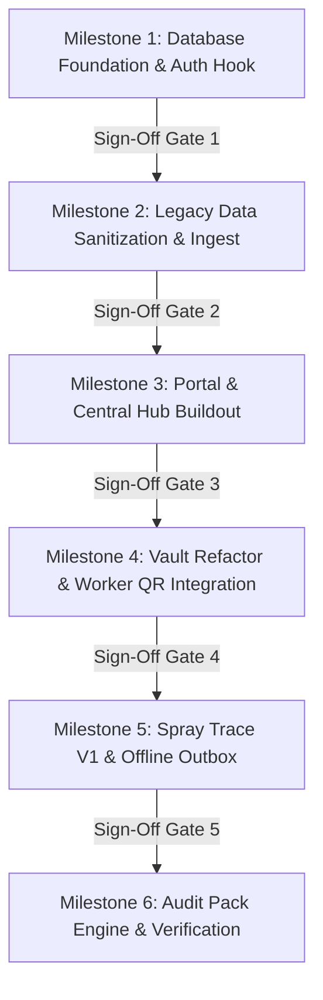

# Simple Solutions Ecosystem — Legacy Migration & Modernization Plan

> **Architectural Specification & Transition Plan**  
> *Target Monorepo Architecture: Hub-and-Spoke Micro-App Ecosystem (`portal/`, `tools/`, `packages/`)*  
> *Primary Source of Truth: [`PROJECT_BRAIN.md`](file:///home/luca/dev/simple-solutions-ecosystem/PROJECT_BRAIN.md)*  
> *Author: Lead Systems Architect (`@architect`)*  
> *Date: September 2026*

---

## Executive Summary & Ingest Findings

A comprehensive inspection of the legacy `/legacy` codebase (`the-vault-web`) and remote database exports reveals an established, functioning production system for agricultural occupational health and safety (OHSA Act 85 of 1993, GlobalG.A.P., SIZA v6, POPIA Act 4 of 2013). However, the legacy architecture exhibits key structural limitations that prevent multi-tool scaling and offline frontline reliability:

1. **Free-Text Worker Anti-Pattern**: Frontline workers were never modeled as first-class database entities. In legacy `training_records`, employee names, payroll numbers, and genders were captured as unverified free-text strings on every submission. This makes cross-tool labor tracking (e.g., attributing spray operators or tractor drivers) impossible.
2. **Monolithic Root File Layout**: All pages (`vault.html`, `records.html`, `sop.html`, `risk-assessments.html`, `partner-portal.html`) sat in the root directory, tied together by a monolithic `profile-engine.js` script with mixed concerns (auth, modal DOM injection, Paystack billing, crop gating, and RPC orchestration).
3. **Recursive RLS & Subquery Overhead**: Many legacy RLS policies relied on nested subqueries (`WHERE company_id IN (SELECT company_id FROM profiles WHERE id = auth.uid())`), introducing query latency and risk of PostgreSQL recursion (`42P17`).
4. **Missing Offline & Act 36 Operational Engines**: While chemical spraying and fertilizer handling existed as video SOPs and static risk assessments, actual field application records (Act 36 registration numbers, MRL withholding periods, dosage logging) were absent.

This migration plan defines the exact schema transformations, custom JWT authorization hook specifications, decoupled directory structure, and phased milestone roadmap to transition legacy assets into the **Simple Solutions Ecosystem**.

---

## 1. Core Schema Entities: Retain, Drop, Rename & Modernize

The legacy database comprises 18 tables and 1 view (`partner_supply_chain_metrics`). Below is the definitive disposition matrix comparing legacy schemas against the Master Blueprint.

### 1.1 Entity Disposition Matrix

| Legacy Entity | Target Status | Target Table / Destination | Architectural Rationale & Data Strategy |
| :--- | :---: | :--- | :--- |
| `companies` | **RETAIN & EXTEND** | `companies` | Retain core tenant identity. Add `primary_site_id`, `billing_model` (`flat_site_bundle`), and company-wide defaults. Drop seat-limit logic in favor of unlimited frontline workers. |
| `profiles` | **RETAIN & REFURBISH** | `profiles` | Strictly for authenticated control-plane users (Admin, Manager, Agronomist, Supervisor). Disentangle from frontline laborers. Add `authorized_sites` array or link to `site_profile_access`. |
| *New Entity* | **CREATE** | `sites` | Physical farms, depots, workshops, and packhouse facilities under a tenant `company_id`. Enables the flat R2,250/site commercial model. |
| *New Entity* | **CREATE** | `zones` & `zone_versions` | Spatial blocks/orchards linked to `sites`. Required for Spray Trace V1 block applications and PostGIS boundary lineage. |
| *New Entity* | **CREATE** | `workers` | Master frontline labor registry (`employee_code`, `full_name`, `preferred_language`, `worker_group`, `consent_flags`). Workers **never** hold Auth accounts. |
| *New Entity* | **CREATE** | `worker_qr_tokens` | Opaque cryptographic tokens for physical QR badges. Scanned in field for < 30s identity attribution with zero PII exposure. |
| `training_records` | **MIGRATE & SPLIT** | `training_completions` + `signature_events` | Extract legacy free-text workers into `workers` table. Split verification signatures into immutable append-only `signature_events` with SHA-256 digests. |
| `videos` | **RENAME & MODERNIZE** | `training_assets` | Standardize metadata: Vimeo video ID, duration, multilingual tracks (EN/ZU), category, sub-tag, and crop pack associations. |
| `sops` | **RETAIN & MODERNIZE** | `sops` | Retain document references in `sops` Supabase private bucket. Modernize version lineage tracking and partner document overrides. |
| `user_video_progress` | **RETAIN & SCOPE** | `user_video_progress` | Tracks video playback progress. Scoped strictly to authenticated `profiles.id` (`auth.uid()`). |
| `baseline_ra_templates` | **RENAME & STANDARDIZE**| `checklist_templates` (`type = 'baseline_ra'`) | Generalize into ecosystem checklist template schema with standardized hazard matrices. |
| `risk_assessment_templates` | **RENAME & STANDARDIZE**| `checklist_templates` (`type = 'task_ra'`) | Generalize task-specific risk templates (PPE, pre-use checks, safe work procedures). |
| `company_baseline_assessments` | **RENAME & REFURBISH** | `company_risk_assessments` (`category = 'baseline'`) | Merge baseline assessments with review schedules, Section 16(2) appointee signatures, and 12-month renewal triggers. |
| `company_risk_assessments` | **RETAIN & REFURBISH** | `company_risk_assessments` (`category = 'task'`) | Link to specific `site_id`, `zone_id`, or `asset_id`. Store Likelihood x Severity matrices and verified PPE checklists. |
| `corporate_partners` | **RENAME & EXTEND** | `spray_processor_networks` | Retain commercial processor registry (e.g., Coastal Macadamia). Extend to govern dual-portal access and supplier agreements. |
| `partner_grower_registry` | **RENAME & EXTEND** | `spray_supplier_links` | Replaces static grower code lookup with formal cross-tenant supplier linkage, governing automated projection of spray logs. |
| `partner_portal_tokens` | **RETAIN & HARDEN** | `partner_portal_tokens` | Retain 35-day rotating zero-login magic tokens for processor compliance officers. Add strict IP and rate-limiting telemetry. |
| `partner_supply_chain_metrics`| **REVISE VIEW** | `partner_supply_chain_metrics` | Update SQL view to read from normalized `training_completions`, `workers`, and `company_risk_assessments`. Retain SIZA `<5` worker privacy suppression. |
| `crop_pack_addon_purchases` | **ARCHIVE / LEGACY** | `legacy_crop_pack_purchases` | Retain historical audit ledger of Paystack R80/mo charges. Transition new subscriptions to flat site-based packaging. |
| `crop_pack_addon_subscriptions`| **ARCHIVE / LEGACY** | `legacy_crop_pack_subscriptions`| Maintain existing recurring Paystack subscriptions until accounts migrate to unified site billing. |
| `processor_referral_leads` | **RETAIN** | `processor_referral_leads` | In-app lead intake pipeline for grower-recommended commercial processors. |
| `support_tickets` | **RETAIN** | `support_tickets` | In-app support ticketing system. Add `site_id` context. |
| `sandbox_jsonb_backup` | **DROP** | None | Legacy temporary migration backup table. Not needed in new production schema. |
| *New Entity* | **CREATE** | `audit_events` | Immutable cross-tool audit trail capturing actor, entity, action, `client_uuid`, and change diff. |
| *New Entity* | **CREATE** | `sync_inbox` & `attachments` | Offline PWA outbox sync ingestion table for Dexie.js transactions over 2G/EDGE networks. |
| *New Entity* | **CREATE** | `spray_product_library` | Master Act 36 registry: registration numbers, active ingredients, dosage limits, withholding intervals. |
| *New Entity* | **CREATE** | `spray_applications` | Frontline spray logs: `site_id`, `zone_id`, `worker_id` (operator), `verifier_profile_id`, weather, dosage. |
| *New Entity* | **CREATE** | `spray_processor_submissions`| Sanitized `export_row` JSON projected into processor tenant space for 1-click exporter CSV generation. |

---

## 2. Supabase Specifications: JWT Custom Claims Hook & RLS Architecture

### 2.1 The Two-Tier Identity Model

```
                    +------------------------------------+
                    |        Supabase Auth Users         |
                    |            (auth.users)            |
                    +-----------------+------------------+
                                      | 1:1
                                      v
+-------------------------------------+--------------------------------------+
|                         CONTROL-PLANE PROFILES                             |
|                               (profiles)                                   |
| • Authenticated users: Owners, Admins, Farm Managers, Agronomists          |
| • Log in with email/password or Google OAuth                               |
| • Hold custom JWT Claims: company_id, role, authorized site_ids             |
| • Verified signing authorities on all statutory field transactions        |
+-------------------------------------+--------------------------------------+
                                      |
                     Supervises / Attributes / Verifies
                                      |
+-------------------------------------v--------------------------------------+
|                         FRONTLINE FIELD WORKERS                            |
|                               (workers)                                    |
| • Tractor Drivers, Spray Operators, General Laborers, Sorters              |
| • NEVER hold auth accounts; NEVER log in; ZERO seat license tax            |
| • Identified via physical QR Badges (worker_qr_tokens) or roster select    |
| • Lightweight entity records linked to training and spray events           |
+----------------------------------------------------------------------------+
```

### 2.2 Custom Access Token (JWT) Hook Specification

To eliminate recursive subqueries (`EXISTS (SELECT 1 FROM profiles ...)`), prevent error `42P17`, and accelerate RLS evaluation to sub-millisecond execution, Supabase Auth will execute a PostgreSQL `custom_access_token_hook`.

#### PostgreSQL Function: `auth.custom_access_token_hook`
```sql
CREATE OR REPLACE FUNCTION auth.custom_access_token_hook(event jsonb)
RETURNS jsonb
LANGUAGE plpgsql
STABLE
SECURITY DEFINER
SET search_path = public
AS $$
DECLARE
  v_user_id uuid;
  v_company_id uuid;
  v_role text;
  v_site_ids uuid[];
  v_claims jsonb;
BEGIN
  -- Extract user ID from auth event
  v_user_id := (event->>'user_id')::uuid;
  v_claims := event->'claims';

  -- Fetch user profile metadata
  SELECT company_id, role
  INTO v_company_id, v_role
  FROM public.profiles
  WHERE id = v_user_id;

  -- Fetch authorized sites for user
  SELECT COALESCE(array_agg(site_id), '{}')
  INTO v_site_ids
  FROM public.site_profile_access
  WHERE profile_id = v_user_id;

  -- If no explicit site access mapped, default to all company sites if admin
  IF cardinality(v_site_ids) = 0 AND (lower(v_role) LIKE '%admin%' OR lower(v_role) = 'owner') THEN
    SELECT COALESCE(array_agg(id), '{}')
    INTO v_site_ids
    FROM public.sites
    WHERE company_id = v_company_id;
  END IF;

  -- Inject claims into JWT
  v_claims := jsonb_set(v_claims, '{company_id}', to_jsonb(v_company_id));
  v_claims := jsonb_set(v_claims, '{role}', to_jsonb(COALESCE(v_role, 'Staff')));
  v_claims := jsonb_set(v_claims, '{site_ids}', to_jsonb(COALESCE(v_site_ids, '{}'::uuid[])));

  event := jsonb_set(event, '{claims}', v_claims);
  RETURN event;
END;
$$;

GRANT EXECUTE ON FUNCTION auth.custom_access_token_hook TO supabase_auth_admin;
REVOKE EXECUTE ON FUNCTION auth.custom_access_token_hook FROM public, authenticated, anon;
```

### 2.3 Row Level Security (RLS) Policy Standards

All tables must enforce RLS using JWT claim extraction via `auth.jwt()`.

#### Helper Expression:
```sql
-- Fast tenant isolation
(auth.jwt() ->> 'company_id')::uuid = company_id

-- Fast site scope verification
site_id = ANY(ARRAY(SELECT jsonb_array_elements_text(auth.jwt() -> 'site_ids'))::uuid[])
```

#### Canonical RLS Rules:
1. **`companies`**:
   - `SELECT`: `id = (auth.jwt() ->> 'company_id')::uuid`
   - `UPDATE`: `id = (auth.jwt() ->> 'company_id')::uuid AND (auth.jwt() ->> 'role') IN ('Owner', 'Master Admin', 'Admin')`
   - Direct browser mutation of billing status, tier, or modules is strictly denied.
2. **`profiles`**:
   - `SELECT`: `company_id = (auth.jwt() ->> 'company_id')::uuid`
   - `UPDATE`: `id = auth.uid() OR ((auth.jwt() ->> 'company_id')::uuid = company_id AND (auth.jwt() ->> 'role') IN ('Owner', 'Master Admin', 'Admin'))`
3. **`workers` & `worker_qr_tokens`**:
   - `SELECT`: `company_id = (auth.jwt() ->> 'company_id')::uuid`
   - `INSERT / UPDATE`: `company_id = (auth.jwt() ->> 'company_id')::uuid AND (auth.jwt() ->> 'role') IN ('Owner', 'Admin', 'Farm Manager', 'Supervisor')`
4. **`training_completions` & `company_risk_assessments`**:
   - `SELECT`: `company_id = (auth.jwt() ->> 'company_id')::uuid`
   - `INSERT`: `company_id = (auth.jwt() ->> 'company_id')::uuid AND verifier_profile_id = auth.uid()`
5. **`spray_applications`**:
   - `SELECT`: `company_id = (auth.jwt() ->> 'company_id')::uuid`
   - `INSERT`: `company_id = (auth.jwt() ->> 'company_id')::uuid AND verifier_profile_id = auth.uid()`
6. **`spray_processor_submissions`**:
   - Strictly isolated to processor tenant:
   - `SELECT`: `processor_company_id = (auth.jwt() ->> 'company_id')::uuid`
   - `INSERT`: Strictly service-role execution via Edge Function; no browser client insert.

---

## 3. Decoupled Monorepo Architecture

Following the Zero-Build, Vanilla ES6 + Tailwind architecture, the monolithic root files are partitioned into cleanly isolated workspaces:

```
simple-solutions-ecosystem/
├── portal/                          # Central Hub: Tenant Admin, Worker Registry & Auth
│   ├── index.html                   # Public landing page & application launcher
│   ├── dashboard/                   # Unified operations cockpit & cross-tool analytics
│   │   ├── index.html
│   │   └── dashboard.js
│   ├── admin/                       # Tenant admin: company setup, sites, zones, Paystack billing
│   │   ├── index.html
│   │   └── admin.js
│   ├── workers/                     # Master Worker Directory: CSV import & QR badge issuer
│   │   ├── index.html
│   │   └── workers.js
│   └── assets/                      # Portal styling, icons, and shared client auth scripts
│       └── js/
│           ├── auth.js              # Supabase session lifecycle & JWT handler
│           └── api-client.js        # Shared authenticated PostgREST & RPC wrapper
│
├── tools/                           # Modular operational spokes (decoupled micro-apps)
│   ├── vault/                       # LIVE CORE: Operations, Training & Compliance
│   │   ├── index.html               # Training video LMS & catalog (migrated vault.html)
│   │   ├── classroom.html           # Video player & dual-signature sign-off (migrated module.html)
│   │   ├── registers.html           # Statutory training registers & PDF certificates (records.html)
│   │   ├── risk-assessments.html    # Baseline (BRA) & Task risk matrices (risk-assessments.html)
│   │   ├── sops.html                # Digital SOP document library & downloads (sop.html)
│   │   ├── audit-pack.html          # Automated 1-click GlobalG.A.P. & SIZA audit pack export
│   │   └── assets/
│   │       ├── js/
│   │       │   ├── vault-engine.js  # Catalog filtering, Vimeo SDK, and signature pad logic
│   │       │   ├── pdf-generator.js # jsPDF certificate and register generator
│   │       │   └── qr-verifier.js   # Frontline worker QR badge camera scanner
│   │       └── css/
│   │
│   ├── spray-trace/                 # UPCOMING (M1-M4): Agronomic compliance & processor network
│   │   ├── index.html               # Agronomy dashboard: active withholding timers, application logs
│   │   ├── record.html              # <30s Offline Field Spray Form (Dexie.js outbox)
│   │   ├── chemical-store.html      # Act 36 Chemical Library & inventory balances
│   │   ├── processor/               # Trojan Horse Processor Portal (migrated partner-portal.html)
│   │   │   ├── index.html           # Exporter compliance overview & supplier map
│   │   │   └── export.html          # Deterministic CSV export generator with checksums
│   │   └── assets/
│   │       └── js/
│   │           ├── spray-db.js      # Dexie.js offline schema & transaction outbox
│   │           ├── sync-client.js   # Edge Function sync worker for 2G/EDGE networks
│   │           └── act36-validator.js# Dosage & withholding interval verification
│   │
│   ├── fleet-log/                   # DISCOVERY-LED: Machinery pre-starts, fuel ledger
│   │   └── assets/
│   │
│   └── packhouse-pass/              # DISCOVERY-LED: Intake scanning, QC & lot traceability
│       └── assets/
│
├── packages/                        # Shared contracts, database schemas & design tokens
│   ├── db/                          # Master DDL schemas, migration manifests, and seed data
│   │   ├── schema.sql
│   │   └── seeds/
│   ├── shared-types/                # TypeScript interface definitions
│   │   ├── identity.d.ts            # Profile, Worker, QR Token contracts
│   │   ├── sync.d.ts                # Offline Command JSON schemas
│   │   └── agronomy.d.ts            # Act 36 Product & Application contracts
│   └── ui/                          # Mobile-first Tailwind tokens, brand logos, and UI components
│       ├── assets/
│       │   ├── brand/               # Master SVG and PNG brand marks
│       │   └── styles/              # Shared Tailwind custom classes
│       └── components/              # Standalone reusable HTML snippets (modals, drawers)
│
├── supabase/                        # Unified backend infrastructure
│   ├── migrations/                  # Timestamped multi-tenant PostgreSQL migrations with RLS
│   └── functions/
│       ├── sync_inbox/              # Receives offline Dexie.js JSON commands
│       ├── processor_bridge/        # Validates supplier link & projects export rows
│       ├── audit_pack/              # Compiles statutory zip archive with PDF index
│       └── paystack_webhook/        # HMAC-verified recurring subscription handler
│
├── docs/                            # Architecture, Migration, and Statutory Documentation
│   ├── MIGRATION_PLAN.md            # This document
│   └── statutory/                   # Act 36, SIZA, and OHSA compliance schedules
│
├── scripts/                         # Operational automation
│   ├── sync_schema.sh               # Synchronizes remote Supabase schema into packages/db
│   └── migrate_legacy_data.py       # Data sanitization & worker extraction script
│
├── AGENTS.md                        # Master agent behavioral rules
└── PROJECT_BRAIN.md                 # Primary architectural source of truth
```

---

## 4. Legacy Ingestion & Data Transformation Strategy

### 4.1 Frontline Worker Extraction (`training_records` $\to$ `workers`)
In the legacy database, `training_records` stores approximately hundreds of training entries with free-text worker names. A migration script (`scripts/migrate_legacy_data.py`) will:
1. Query distinct combinations of `(company_id, employee_name, employee_number, gender)` from `training_records`.
2. Generate deterministic UUIDs for each unique worker based on `uuid5(NAMESPACE_DNS, f"{company_id}:{employee_number or employee_name}")`.
3. Insert sanitized rows into `public.workers`:
   - `company_id`: matched from record
   - `employee_code`: sanitized `employee_number` (or generated `WKR-{hash}`)
   - `full_name`: trimmed, title-cased `employee_name`
   - `gender`: preserved from record
   - `worker_group`: `'General Workforce'`
   - `active`: `true`
4. Mint initial `worker_qr_tokens` for all extracted workers.
5. Backfill `training_completions`:
   - Point `worker_id` to the newly minted worker UUID.
   - Point `verifier_profile_id` to the matching profile where `profiles.company_id = company_id` and role is supervisor/admin.

### 4.2 Storage Bucket Preservation
Legacy bucket assets listed in `Supabase Snippet Full Bucket Export.csv` will be migrated:
- **Bucket `sops` (109 files)**: Move to standardized tenant path `sops/{company_id}/{sop_code}.pdf`. Update `sops.doc_url` to point to authenticated signed storage paths.
- **Bucket `thumbnails` (106 files)**: Move to public asset CDN or `packages/ui/assets/thumbnails/` to avoid repeated remote storage lookups.

---

## 5. Step-by-Step Milestone Implementation Plan (Sign-Off Gates)

The migration is organized into six sequential milestones. Each milestone requires explicit verification and user sign-off before subsequent phases commence.



### Milestone 1: Master Schema & Database Foundation
- [ ] Draft timestamped migration `supabase/migrations/20260928000000_core_ecosystem_foundation.sql`.
- [ ] Define tables: `companies`, `sites`, `zones`, `zone_versions`, `site_profile_access`, `profiles`, `workers`, `worker_qr_tokens`, `company_modules`, `audit_events`.
- [ ] Implement `auth.custom_access_token_hook` and grant execution permissions to `supabase_auth_admin`.
- [ ] Enable RLS on all tables with zero-recursion `auth.jwt()` claim policies.
- [ ] Create automated SQL test script verifying that cross-tenant queries fail with 0 rows returned.
- **Sign-Off Gate 1**: Schema deployed to development Supabase instance; JWT token hook successfully adds `company_id` and `site_ids`; RLS isolation verified.

### Milestone 2: Legacy Data Sanitization & Worker Extraction
- [ ] Build idempotent Python migration script `scripts/migrate_legacy_data.py`.
- [ ] Extract distinct worker entities from legacy `training_records` and populate `workers` and `worker_qr_tokens`.
- [ ] Transform legacy `training_records` into normalized `training_completions` and `signature_events`.
- [ ] Migrate legacy `sops` and `videos` into `sops` and `training_assets`.
- [ ] Validate that SIZA privacy view `partner_supply_chain_metrics` produces identical aggregates against new normalized tables.
- **Sign-Off Gate 2**: Dry-run migration against staging database; worker entity count matches legacy attendance logs; zero data loss in completion history.

### Milestone 3: Portal & Central Management Hub Buildout
- [ ] Build `portal/` static entry point with unified authentication (`portal/assets/js/auth.js`).
- [ ] Implement Tenant Administration (`portal/admin/`): Company details, site creation, block/zone GIS editor, module toggles.
- [ ] Implement Worker Directory (`portal/workers/`):
  - Payroll CSV import wizard (column mapping: name, employee number, group, language).
  - Bulk printable QR badge generation (SVG/HTML sheet for thermal/card printers).
- [ ] Implement unified session state: tools load active tenant and authorized sites seamlessly.
- **Sign-Off Gate 3**: Admin can log in, create a site, import a worker CSV roster, and print a sheet of worker QR badges.

### Milestone 4: Vault Refactoring & Frontline QR Integration
- [ ] Relocate legacy `vault.html`, `module.html`, `records.html`, `risk-assessments.html`, `sop.html` into `tools/vault/`.
- [ ] Replace legacy free-text worker row input in `classroom.html` with:
  1. Frontline Worker QR camera scanner (`qr-verifier.js`).
  2. Quick-filter supervisor worker dropdown (reads from local tenant cache).
- [ ] Connect completion logger to `training_completions` and `signature_events`.
- [ ] Refactor `registers.html` and `risk-assessments.html` to consume normalized schemas.
- **Sign-Off Gate 4**: Full classroom training flow tested on mobile: scan worker QR badge $\rightarrow$ sign as supervisor $\rightarrow$ verify record in statutory training register.

### Milestone 5: Spray Trace V1 & Offline Outbox Implementation
- [ ] Initialize `tools/spray-trace/` with offline-first PWA manifest and service worker.
- [ ] Configure client-side IndexedDB engine using Dexie.js (`spray-db.js`).
- [ ] Build `< 30s` mobile field spray form (`record.html`): Site $\rightarrow$ Block $\rightarrow$ Chemical $\rightarrow$ Liters $\rightarrow$ Operator QR scan $\rightarrow$ Save.
- [ ] Build Deno Edge Function `supabase/functions/sync_inbox/` for idempotent JSON outbox synchronization.
- [ ] Implement Trojan Horse Processor Bridge: Edge Function projects validated records into `spray_processor_submissions`.
- [ ] Port `partner-portal.html` into `tools/spray-trace/processor/` for exporter CSV generation.
- **Sign-Off Gate 5**: Disconnect device Wi-Fi $\rightarrow$ log 3 field spray records offline $\rightarrow$ reconnect Wi-Fi $\rightarrow$ verify records sync to server and appear on processor export dashboard.

### Milestone 6: Automated Audit Pack Engine & Session Wrap-Up
- [ ] Implement Deno Edge Function `supabase/functions/audit_pack/` to compile deterministic zip packages for GLOBALG.A.P. IFA v6 and SIZA v6.
- [ ] Generate cryptographic SHA-256 manifest (`manifest.json`) and PDF executive summary index.
- [ ] Run defensive security audit (`@auditor`) verifying zero client secret leaks and strict RLS compliance.
- [ ] Run session closer (`@closer`) to synchronize remote schema and update `PROJECT_BRAIN.md`.
- **Sign-Off Gate 6**: Click "Generate Audit Pack" $\rightarrow$ download structured ZIP folder $\rightarrow$ verify all training certificates, risk assessments, and spray logs are cryptographically sealed.

---

## 6. Risk Assessment & Mitigation Matrix

| Identified Architectural Risk | Severity | Failure Scenario | Automated / Engineering Mitigation |
| :--- | :---: | :--- | :--- |
| **Worker Identity Fragmentation** | High | Workers re-entered with slight spelling differences create duplicate rows. | Enforce unique constraint on `(company_id, lower(employee_code))`. Provide supervisor merge utility in `portal/workers/`. |
| **Offline Command Conflicts** | Medium | Multiple supervisors log applications in the same block concurrently while offline. | Append-only transaction logging with client UUIDv4 idempotency. Server merges records without overwriting historical compliance rows. |
| **PostgreSQL 42P17 RLS Recursion** | High | RLS policies checking profile role query `profiles`, re-triggering RLS infinitely. | Completely avoided by evaluating roles and company context via custom JWT claims hook (`auth.jwt() ->> 'role'`). |
| **Exposing PII on Worker Badges** | High | Lost worker QR badge leaks South African ID numbers or personal details. | QR badges encode opaque random UUID tokens only. De-anonymization occurs solely on authenticated server or authorized local cache. |
| **Processor Data Leakage** | Critical | Processor queries supplier database directly, exposing un-linked grower records. | Strict RLS prevents cross-tenant queries. Processor portal reads only sanitized summary projections from `spray_processor_submissions`. |
